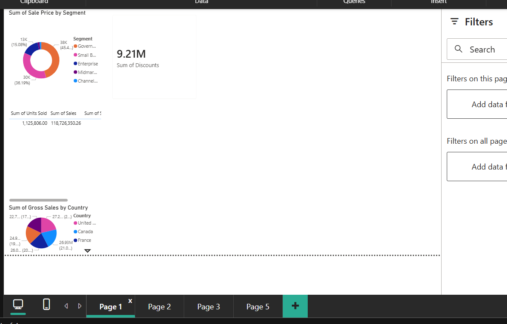

# Getting Started Guide

A step-by-step guide for new users.

---

## About This Project


This is a **proof of concept** demonstrating how Power BI report formatting can be streamlined using scripts and AI assistance.

**Future Development**: The goal is to integrate this toolkit with the wider Power Platform ecosystem (Power Automate and Power Apps) to provide a user-friendly front end that doesn't require any coding knowledge. This integration is currently in development as I continue to expand my skills across these platforms.

**Current State**: The toolkit is fully functional and can be used as-is. However, it does require:
- Basic familiarity with running Python scripts
- Comfort using VS Code
- Following the step-by-step instructions below

**Disclaimer**: This project is provided as-is for educational and productivity purposes. Please test thoroughly with non-critical reports before using on important work. Always keep backups of your original files.

---

## What You Need

Before you begin:

1. **Python** installed on your computer (version 3.10 or higher)
2. **VS Code** with the Python extension installed
3. **Power BI Desktop** installed
4. **A Power BI report** saved in PBIP format (covered below)

---

## Step 1: Download This Project

1. Go to https://github.com/jennifer-hunter/Power_BI_agent_KB
2. Click the green **Code** button
3. Click **Download ZIP**
4. Extract the ZIP file to a folder you can find easily
   - Right-click the ZIP file → **Extract All** → Choose a location → **Extract**

---

## Step 2: Open the Project in VS Code

1. Open **VS Code**
2. Click **File** → **Open Folder**
3. Navigate to the extracted folder (e.g. `Power_BI_agent_KB`)
4. Click **Select Folder**
5. If prompted about trusting the authors, click **Yes, I trust the authors**

---

## Step 3: Install Required Packages

1. In VS Code, look at the bottom of the screen for the **Terminal** panel
2. If you don't see it, go to **View** → **Terminal**
3. In the Terminal, you'll see a text input area
4. Click in the Terminal and type exactly:
   ```
   pip install -r requirements.txt
   ```
5. Press **Enter**
6. Wait for the installation to complete

---

## Step 4: Prepare Your Power BI Report

The key principle: **add your data and visuals, but don't waste time formatting**.

1. Open **Power BI Desktop**
2. Load your data source(s)
3. Create all the pages you need
4. Add all your visuals (charts, tables, KPIs, slicers)
5. Configure the data bindings for each visual (which fields go where)
6. **Leave everything in default positions** - don't align, resize, or style anything

The toolkit will handle the formatting for you. Your starting point should look something like this:



*Just add your visuals with data and leave them wherever Power BI places them. The scripts will organise and style everything.*

---

## Step 5: Save Your Report as PBIP

This toolkit works with PBIP format (folder-based), not the standard PBIX format (single file).

1. In **Power BI Desktop** with your report open
2. Click **File** → **Save as**
3. In the "Save as type" dropdown, select **Power BI Project (*.pbip)**
4. Choose a location and click **Save**

This creates a folder ending in `.Report` (e.g. `MyReport.Report`)

---

## Step 6: Create Your Configuration File

You need to tell the scripts where your files are.

1. In VS Code, find the file `.env.sample` in the left panel
2. Right-click on it and select **Copy**
3. Right-click in the Explorer panel and select **Paste**
4. Right-click the copied file and select **Rename**
5. Rename it to `.env` (remove the .sample part)
6. Double-click to open the `.env` file
7. **Replace the placeholder paths** with your actual file locations:

| Setting | What to put |
|---------|-------------|
| `INPUT_DIR` | The full path to your .Report folder from Step 4 |
| `OUTPUT_FILE` | Where you want the Word document saved |
| `INPUT_WORD_DOC` | Same as OUTPUT_FILE (or the edited version later) |
| `OUTPUT_REPORT_DIR` | Where you want the final report saved |

**Example with real paths:**
```
INPUT_DIR=C:\Users\JohnSmith\Documents\SalesReport.Report
OUTPUT_FILE=C:\Users\JohnSmith\Documents\SalesReport_flattened.docx
INPUT_WORD_DOC=C:\Users\JohnSmith\Documents\SalesReport_flattened.docx
OUTPUT_REPORT_DIR=C:\Users\JohnSmith\Documents\SalesReport_output.Report
```

7. Press **Ctrl + S** to save the file

---

## Step 7: Flatten Your Report to Word

This converts your report into a single Word document.

1. In VS Code, click on `directory_flattener.py` in the left panel to open it
2. Click the **Run** button (play icon ▶) in the top right corner
3. Or right-click in the code and select **Run Python File in Terminal**

**What you should see in the Terminal:**
```
Directory Flattener
==================================================
Input:  C:\Users\JohnSmith\Documents\SalesReport.Report
Output: C:\Users\JohnSmith\Documents\SalesReport_flattened.docx
==================================================

  Added: definition/report.json
  Added: definition/pages/page1/page.json
  ...

Flattening complete!
  Files processed: 21
  Files skipped: 0
```

You now have a Word document containing all your report's JSON files.

---

## Step 8: Choose Your Route

### Route A: Non-AI (Automatic Formatting)

1. Click on `report_reformatter.py` to open it
2. Click the **Run** button (▶) in the top right
3. Wait for it to complete
4. Click on `restore_from_word.py` to open it
5. Click the **Run** button (▶) in the top right

Skip to **Step 10**.

---

### Route B: AI-Assisted

First, configure your Copilot agent using [AGENT_CONFIG.md](AGENT_CONFIG.md).

Then:
1. Find the Word document created in Step 7 (at your OUTPUT_FILE location)
2. Upload the entire Word document to your trained Copilot agent
3. The agent will analyse your report structure and suggest formatting improvements
4. Chat with the agent to explore different themes, adjust layouts, or refine the design to match your vision
5. Download the edited Word document from Copilot
6. Save it to your INPUT_WORD_DOC location (or update the path in your .env file)
7. Continue to Step 9

See [PROMPT_GUIDE.md](PROMPT_GUIDE.md) for safe, low-risk prompts you can use with your Copilot agent.

**Alternative - Manual editing:**
If you prefer, you can also open the Word document and edit the JSON directly yourself (changing colours, positions, etc.)

---

## Step 9: Restore Your Edited Report

Convert the Word document back into a Power BI report:

1. Click on `restore_from_word.py` to open it
2. Click the **Run** button (▶) in the top right

**What you should see:**
```
Restore from Word
==================================================
Input:  C:\Users\JohnSmith\Documents\SalesReport_flattened.docx
Output: C:\Users\JohnSmith\Documents\SalesReport_output.Report
==================================================

Parsing Word document...
Found 21 files to restore.

Restoring files:
  [OK] definition/report.json
  [OK] definition/pages/page1/page.json
  ...

Restoration complete!
  Files written: 21
  Files failed:  0
```

---

## Step 10: Finalise Your Report

Before opening in Power BI, you need to rename the folders:

1. Rename your original `.Report` folder to something else (e.g., add `_backup` to the end)
2. Rename the output folder to match the original folder name (remove the `_reformatted` part)

**Why isn't this automated?**
This manual step is intentional - it acts as a safeguard, giving you the opportunity to review the output before replacing your original work.

---

## Step 11: Open Your Reformatted Report

1. Open **Power BI Desktop**
2. Click **File** → **Open report**
3. Navigate to your `.pbip` file and click **Open**

If you've renamed the folders correctly, the report will load with all your formatting changes applied.

---

## Quick Reference

| What you want to do | Which file to run |
|---------------------|-------------------|
| Flatten report to Word | `directory_flattener.py` |
| Auto-format report | `report_reformatter.py` |
| Restore Word to report | `restore_from_word.py` |

**To run any script:** Click to open → Click the **Run** button (▶)

