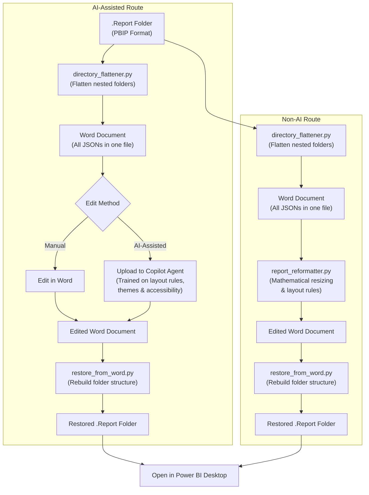

# Customisable Power BI Report Formatter

**Authored by Jennifer Hunter and Claude Code (Anthropic)**

> **Built with AI**: This project is a human-AI collaboration. Jennifer provided the concept, direction, and domain expertise; Claude (Anthropic's AI) wrote the code and documentation. What you're reading right now? Claude wrote that too.

---

## Contents

- [About This Project](#about-this-project)
- [Known Bugs](#known-bugs)
- [Why This Exists](#why-this-exists)
- [Ethical AI Use](#ethical-ai-use)
- [What is Power BI?](#what-is-power-bi)
- [PBIP File Structure](#pbip-file-structure)
- [How It Works](#how-it-works)
- [Installation](#installation)
- [Copilot Agent Training](#copilot-agent-training)
- [Why Claude](#why-claude)
- [Repository Structure](#repository-structure)
- [License](#license)

---

## About This Project

This is a **proof of concept** demonstrating how Power BI report formatting can be streamlined using scripts and AI assistance.

**Current State**: The toolkit is functional (except known theme-renaming bug - see below fo current workaround) and can be used as-is. However, it does require:
- Basic familiarity with running Python scripts
- Comfort using VS Code
- Following the step-by-step instructions in the [Getting Started Guide](GETTING_STARTED.md)

**Disclaimer**: This is a proof of concept - further testing and iteration is needed to improve the reformatting capacity. The code has been reviewed by the author and is believed to be safe, though it has not undergone formal security testing. As with any tool that modifies files, please test with non-critical reports first and always keep backups.

**How This Fits In**: There are excellent Power BI templates and AI-powered template creation solutions available on sites like [powerbi.tips](https://powerbi.tips), and they may offer more polished designs than what this toolkit produces. However, these solutions typically require you to plan all your visuals upfront before generating a layout. This toolkit is designed for a different use case: **customisation after the fact**. It allows you to apply and adjust formatting after changes have been made to a report, enabling constant editing and tweaking to the layout as your report evolves. By combining AI assistance with editable rules, you can iterate on themes, adjust layouts through conversation, and shape the output to match your vision rather than committing to a fixed design from the start.

---

## Known Bugs

**Theme name not updating**: The AI agent does not always update the internal theme name in all required locations. When this happens, Power BI loads the old cached theme and your new theme appears not to work.

**Workaround**: Re-upload the outputted Word document to the agent and prompt it to "change every mention of the theme name to [NewThemeName]". This usually resolves the issue.

**Status**: A more permanent fix is in progress.

---

## Why This Exists

Formatting Power BI reports can be time-consuming. Common tasks include:
- Aligning visuals precisely across pages
- Adjusting colours to meet brand guidelines
- Applying consistent borders, shadows, and spacing
- Replicating layout patterns across multiple reports

This toolkit helps streamline these tedious tasks, allowing analysts to spend more time on what matters most: **understanding data and communicating insights**.

Time saved can be redirected towards creative and analytical work:
- Selecting the most effective visualisations for your data
- Identifying trends and patterns
- Developing meaningful insights
- Presenting findings to stakeholders

---

## Ethical AI Use

This project uses AI assistance responsibly:

- **Choice of AI use, not mandatory**: Provides a fully functional non-AI programmatic route - nobody should be forced to use AI if they prefer not to
- **Universal access**: Word is a familiar format everyone can use - paste it into any free AI tool of your choice, or edit manually, no paid subscriptions required
- **Human-in-the-loop**: AI suggests improvements; humans review and approve every change
- **Transparency**: All AI-generated content is clearly attributed (formatting only)
- **Augmentation, not replacement**: AI handles repetitive formatting; humans handle analysis and decision-making

The goal is to free-up human time to fulfilling and interesting work - data analysis, critical thinking, and creative problem-solving - rather than tedious mechanical tasks that machines can do.

---

## What is Power BI?

**Power BI** is Microsoft's business intelligence platform for creating interactive data visualisations and reports. It connects to various data sources and allows users to build dashboards that help organisations make data-driven decisions.

### File Formats

| Format | Extension | Description |
|--------|-----------|-------------|
| **PBIX** | `.pbix` | Traditional single binary file containing everything (data model, reports, queries). Cannot be version controlled or easily edited. |
| **PBIP** | `.pbip` | Power BI Project format - a folder-based structure with separate JSON files. Human-readable and Git-friendly. |

### Why PBIP Matters

The PBIP format breaks a report into individual JSON files:
- Each page is a separate file
- Each visual is a separate file
- Themes are separate files
- Everything is plain text and editable

This means we can programmatically read, modify, and write report configurations - which is exactly what this toolkit does.

### Important: Two Folders

When you save as PBIP, Power BI creates two key folders:

| Folder | Purpose | This Toolkit |
|--------|---------|--------------|
| **`.Report`** | Visual layouts, themes, page structure | ✅ This is what we modify |
| **`.SemanticModel`** | Data model, queries, measures, relationships | ⛔ Do not touch |

This toolkit only works with the `.Report` folder. Never modify the `.SemanticModel` folder - that contains your data logic and changing it can break your report.

---

## PBIP File Structure

When you save a Power BI report as a `.pbip` project, it creates this structure:

```
MyReport.Report/
├── .pbi/
│   └── localSettings.json      # Local editor settings
├── definition/
│   ├── report.json             # Report-level settings
│   ├── version.json            # Schema version
│   └── pages/
│       ├── pages.json          # Page order and active page
│       └── [page-id]/
│           ├── page.json       # Page settings (name, size)
│           └── visuals/
│               └── [visual-id]/
│                   └── visual.json  # Visual config (type, position, data bindings)
├── StaticResources/
│   └── SharedResources/
│       └── BaseThemes/
│           └── theme.json      # Colour palette and visual styles
└── definition.pbir             # Report metadata
```

### Key JSON Files

| File | Contains |
|------|----------|
| `page.json` | Page display name, dimensions, background |
| `visual.json` | Visual type, position (x, y, width, height), data bindings, queries |
| `theme.json` | Colours, fonts, borders, shadows, default styles |

---

## How It Works



### How Each Step Works

**1. Directory Flattener** (`directory_flattener.py`)

Power BI reports consist of deeply nested folders with multiple JSON files. Navigating this structure and copying content into an AI tool is tedious and error-prone. The directory flattener recursively walks the directory and consolidates everything into a single Word document, making the entire report readable by both humans and machines in one place.

**2a. Non-AI Route** (`report_reformatter.py`)

This script uses mathematical principles to resize and reposition visuals automatically. It calculates optimal positions based on visual types, applies consistent spacing, and outputs an edited Word document - all without any AI involvement.

**2b. AI-Assisted Route** (Copilot Agent)

The trained Copilot agent has been provided with layout rules, theme definitions, accessibility guidelines, and Power BI-specific knowledge. After uploading your flattened document, you can chat with the agent to explore themes, adjust layouts, and refine the design. The agent outputs an edited Word document based on your prompts.

**3. Restore from Word** (`restore_from_word.py`)

Both routes produce an edited Word document. This script parses that document and rebuilds the correct directory structure, placing each JSON file back in its proper location - ready to be opened in Power BI Desktop.

### Script Summary

| Script | Purpose | Input | Output |
|--------|---------|-------|--------|
| `directory_flattener.py` | Flatten report to single document | .Report folder | Word doc |
| `restore_from_word.py` | Restore edited document to report | Word doc | .Report folder |
| `report_reformatter.py` | Apply preset themes and layouts | .Report folder | Reformatted .Report |

---

## Installation

### Prerequisites
- Python 3.10+
- Power BI Desktop (for viewing reports)

### Setup

1. **Clone the repository**
   ```bash
   git clone https://github.com/jennifer-hunter/Power_BI_agent_KB.git
   cd Power_BI_agent_KB
   ```

2. **Install dependencies**
   ```bash
   pip install -r requirements.txt
   ```

3. **Configure environment**

   Copy `.env.sample` to `.env` and update the paths:
   ```
   INPUT_DIR=C:\path\to\your.Report
   OUTPUT_FILE=C:\path\to\output.docx
   INPUT_WORD_DOC=C:\path\to\edited.docx
   OUTPUT_REPORT_DIR=C:\path\to\restored.Report
   ```

4. **Run the scripts**
   ```bash
   # Flatten a report to Word document
   python directory_flattener.py

   # Apply preset formatting directly
   python report_reformatter.py

   # Restore from edited Word document
   python restore_from_word.py
   ```

---

## Copilot Agent Training

> **You will need to configure your own agent.** This toolkit provides the knowledge base and instructions, but you must set up the agent yourself using the guides provided.

> **Testing note:** This toolkit has been tested using a custom GPT on OpenAI 5.2 (the same base model that powers Copilot). It has not yet been tested directly on Copilot Studio, as access to Copilot Studio is not currently available to individuals. If you have access and can test it, feedback is welcome.

The file [COPILOT_KNOWLEDGE.md](COPILOT_KNOWLEDGE.md) is the knowledge base document used to train your Copilot agent. It contains all the layout rules, theme definitions, and formatting instructions the agent needs to reformat Power BI reports.

This toolkit is optimised for use with the **free Copilot Agent Studio**. Further improvements and capabilities could be achieved with:
- A Copilot Pro licence
- AI coding assistants integrated in IDE (e.g., GitHub Copilot)
- Agentic AI coding agents integrated in IDE (e.g., Claude Code, Codex)
- Future software updates to the Power Platform

### Agent Setup

See [AGENT_CONFIG.md](AGENT_CONFIG.md) for step-by-step instructions on configuring your Copilot agent, including the instructions to paste for both Free and Pro versions.

### Prompt Guide

See [PROMPT_GUIDE.md](PROMPT_GUIDE.md) for safe, low-risk prompts you can use with Copilot. These prompts focus on layout and styling only - they won't touch your data, queries, or measures.

---

## Why Claude

This project was developed using Claude Code, Anthropic's agentic AI coding assistant. Here's why Claude excels at tasks like this.

### Understanding AI Benchmarks

AI models are evaluated against standardised tests to measure their capabilities:

| Benchmark | What It Tests |
|-----------|---------------|
| **MMLU** | General knowledge across 57 academic subjects |
| **HumanEval** | Basic coding (164 isolated Python problems) |
| **SWE-bench** | Real-world software engineering (fix actual bugs in GitHub repos) |
| **Humanity's Last Exam** | Expert-level reasoning across maths, sciences, and humanities (2,500 questions from 1,000+ experts) |

### Claude's Performance

| Benchmark | Claude Opus 4.5 Score | Context |
|-----------|----------------------|---------|
| **MMLU** | 90.8% | Saturated - top models all score 88%+ |
| **HumanEval** | 90% | Saturated - top models score 90%+ |
| **SWE-bench** | 80.9% | First model to exceed 80% - leads the field |
| **Humanity's Last Exam** | ~39% | Hardest test - top score is ~46%, Claude near the top |

### Why This Matters for Report Formatting

SWE-bench is the most relevant benchmark for this toolkit because it tests:
- Navigating complex directory structures
- Understanding interconnected files
- Following specific rules to produce working output
- Real-world problem solving, not toy examples

Claude Opus 4 is described as "the best coding model in the world" and leads on SWE-bench - exactly the capabilities needed for parsing Power BI report structures and applying formatting rules correctly.

---

## Repository Structure

```
Power_BI_agent_KB/
├── by-composition/          # Templates by visual mix
│   ├── kpi-dashboard/
│   ├── analytical/
│   ├── executive-summary/
│   └── operational/
├── by-style/                # Templates by visual style
│   ├── corporate-blue/
│   ├── modern-dark/
│   └── clean-minimal/
├── themes/                  # Standalone theme files
├── COPILOT_KNOWLEDGE.md    # AI training document (includes accessibility guidelines)
├── PROMPT_GUIDE.md         # Safe prompts for Copilot
└── AGENT_CONFIG.md         # Agent setup instructions
```

---

## License

This project is licensed under the MIT License - see the [LICENSE](LICENSE) file for details.
