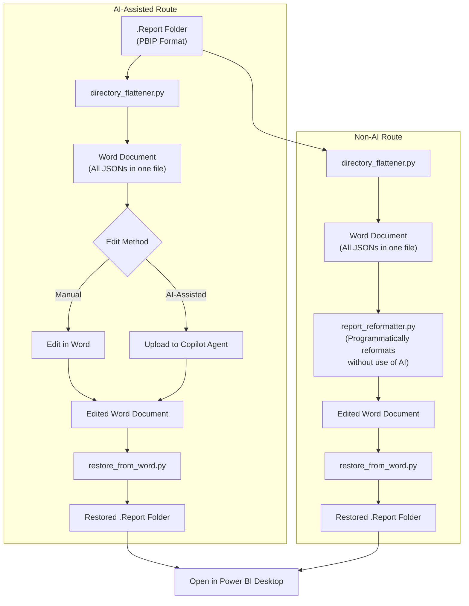

# Power BI Report Design Knowledge Base

**Authored by Jennifer Hunter and Claude Code (Anthropic)**

---

## Contents

- [About This Project](#about-this-project)
- [Why This Exists](#why-this-exists)
- [Ethical AI Use](#ethical-ai-use)
- [Copilot Agent Training](#copilot-agent-training)
- [What is Power BI?](#what-is-power-bi)
- [PBIP File Structure](#pbip-file-structure)
- [How It Works](#how-it-works)
- [Installation](#installation)
- [Repository Structure](#repository-structure)
- [License](#license)

---

## About This Project

This is a **proof of concept** demonstrating how Power BI report formatting can be streamlined using scripts and AI assistance.

**Future Development**: The goal is to integrate this toolkit with the wider Power Platform ecosystem (Power Automate and Power Apps) to provide a user-friendly front end that doesn't require any coding knowledge. This integration is currently in development as I continue to expand my skills across these platforms.

**Current State**: The toolkit is fully functional and can be used as-is. However, it does require:
- Basic familiarity with running Python scripts
- Comfort using VS Code
- Following the step-by-step instructions in the [Getting Started Guide](GETTING_STARTED.md)

**Disclaimer**: This project is provided as-is for educational and productivity purposes. Please test thoroughly with non-critical reports before using on important work. Always keep backups of your original files.

---

## Why This Exists

Formatting Power BI reports can be time-consuming. Common tasks include:
- Aligning visuals precisely across pages
- Adjusting colours to meet brand guidelines
- Applying consistent borders, shadows, and spacing
- Replicating layout patterns across multiple reports

This toolkit helps streamline these tedious tasks, allowing analysts to spend more time on what matters most: **understanding data and communicating insights**.

Time saved can be redirected towards creative and analytical work:
- Selecting the most effective visualisations for your data
- Identifying trends and patterns
- Developing meaningful insights
- Presenting findings to stakeholders

---

## Ethical AI Use

This project uses AI assistance responsibly:

- **Choice of AI use, not mandatory**: Provides a fully functional non-AI programmatic route - nobody should be forced to use AI if they prefer not to
- **Universal access**: Word is a familiar format everyone can use - paste it into any free AI tool of your choice, or edit manually, no paid subscriptions required
- **Human-in-the-loop**: AI suggests improvements; humans review and approve every change
- **Transparency**: All AI-generated content is clearly attributed (formatting only)
- **Augmentation, not replacement**: AI handles repetitive formatting; humans handle analysis and decision-making

The goal is to free-up human time to fulfilling and interesting work - data analysis, critical thinking, and creative problem-solving - rather than tedious mechanical tasks that machines can do.

---

## Copilot Agent Training

The file [COPILOT_KNOWLEDGE.md](COPILOT_KNOWLEDGE.md) is the knowledge base document used to train your Copilot agent. It contains all the layout rules, theme definitions, and formatting instructions the agent needs to reformat Power BI reports.

This toolkit is optimised for use with the **free Copilot Agent Studio**. Further improvements and capabilities could be achieved with:
- A Copilot Pro licence
- More advanced AI models
- Future software updates to the Power Platform

### Agent Setup

See [AGENT_CONFIG.md](AGENT_CONFIG.md) for step-by-step instructions on configuring your Copilot agent, including the instructions to paste for both Free and Pro versions.

### Prompt Guide

See [PROMPT_GUIDE.md](PROMPT_GUIDE.md) for safe, low-risk prompts you can use with Copilot. These prompts focus on layout and styling only - they won't touch your data, queries, or measures.

---

## What is Power BI?

**Power BI** is Microsoft's business intelligence platform for creating interactive data visualisations and reports. It connects to various data sources and allows users to build dashboards that help organisations make data-driven decisions.

### File Formats

| Format | Extension | Description |
|--------|-----------|-------------|
| **PBIX** | `.pbix` | Traditional single binary file containing everything (data model, reports, queries). Cannot be version controlled or easily edited. |
| **PBIP** | `.pbip` | Power BI Project format - a folder-based structure with separate JSON files. Human-readable and Git-friendly. |

### Why PBIP Matters

The PBIP format breaks a report into individual JSON files:
- Each page is a separate file
- Each visual is a separate file
- Themes are separate files
- Everything is plain text and editable

This means we can programmatically read, modify, and write report configurations - which is exactly what this toolkit does.

---

## PBIP File Structure

When you save a Power BI report as a `.pbip` project, it creates this structure:

```
MyReport.Report/
├── .pbi/
│   └── localSettings.json      # Local editor settings
├── definition/
│   ├── report.json             # Report-level settings
│   ├── version.json            # Schema version
│   └── pages/
│       ├── pages.json          # Page order and active page
│       └── [page-id]/
│           ├── page.json       # Page settings (name, size)
│           └── visuals/
│               └── [visual-id]/
│                   └── visual.json  # Visual config (type, position, data bindings)
├── StaticResources/
│   └── SharedResources/
│       └── BaseThemes/
│           └── theme.json      # Colour palette and visual styles
└── definition.pbir             # Report metadata
```

### Key JSON Files

| File | Contains |
|------|----------|
| `page.json` | Page display name, dimensions, background |
| `visual.json` | Visual type, position (x, y, width, height), data bindings, queries |
| `theme.json` | Colours, fonts, borders, shadows, default styles |

---

## How It Works



### Script Summary

| Script | Purpose | Input | Output |
|--------|---------|-------|--------|
| `directory_flattener.py` | Flatten report to single document | .Report folder | Word doc |
| `restore_from_word.py` | Restore edited document to report | Word doc | .Report folder |
| `report_reformatter.py` | Apply preset themes and layouts | .Report folder | Reformatted .Report |

---

## Installation

### Prerequisites
- Python 3.10+
- Power BI Desktop (for viewing reports)

### Setup

1. **Clone the repository**
   ```bash
   git clone https://github.com/jennifer-hunter/Power_BI_agent_KB.git
   cd Power_BI_agent_KB
   ```

2. **Install dependencies**
   ```bash
   pip install -r requirements.txt
   ```

3. **Configure environment**

   Copy `.env.sample` to `.env` and update the paths:
   ```
   INPUT_DIR=C:\path\to\your.Report
   OUTPUT_FILE=C:\path\to\output.docx
   INPUT_WORD_DOC=C:\path\to\edited.docx
   OUTPUT_REPORT_DIR=C:\path\to\restored.Report
   ```

4. **Run the scripts**
   ```bash
   # Flatten a report to Word document
   python directory_flattener.py

   # Apply preset formatting directly
   python report_reformatter.py

   # Restore from edited Word document
   python restore_from_word.py
   ```

---

## Repository Structure

```
Power_BI_agent_KB/
├── by-composition/          # Templates by visual mix
│   ├── kpi-dashboard/
│   ├── analytical/
│   ├── executive-summary/
│   └── operational/
├── by-style/                # Templates by visual style
│   ├── corporate-blue/
│   ├── modern-dark/
│   └── clean-minimal/
├── themes/                  # Standalone theme files
├── COPILOT_KNOWLEDGE.md    # AI training document (includes accessibility guidelines)
├── PROMPT_GUIDE.md         # Safe prompts for Copilot
└── AGENT_CONFIG.md         # Agent setup instructions
```

---

## License

This project is licensed under the MIT License - see the [LICENSE](LICENSE) file for details.

